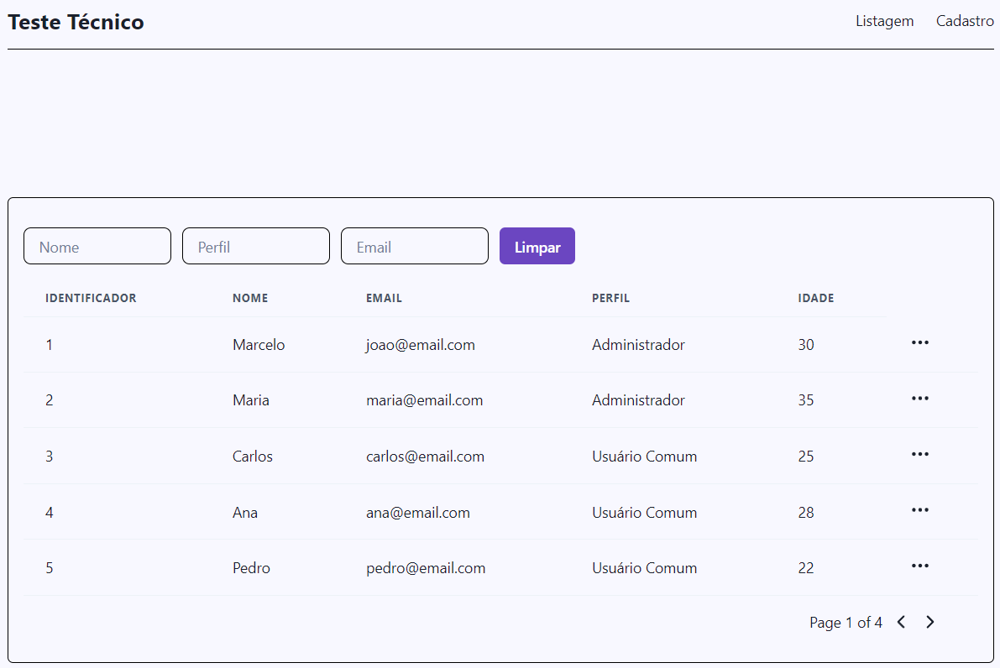

## Sobre o projeto

Pequeno teste da empresa para testar a organização do meu código e meu dominio sobre as bibliotecas impostas para o teste

## Preview do layout



## Stack utilizada

- @tanstack/react-query
- react-input-mask
- react-router-dom
- react-toastify
- lucide-react
- json-server
- axios
- react
- yup

## Rodando localmente

1. clone o repositorio localmente na sua maquina.

```bash
git clone https://github.com/YuriSamp/supera-crud
```

2. Instalando as dependencias.

```bash
pnpm install
```

Para rodar o projeto, abra 2 terminais, um para rodar o front e outro para rodar a fake api

3. Front

```bash
pnpm dev
```

4. Fake-api

```bash
json-server --watch src/data/db.json
```

5. Para rodar os testes

```bash
pnpm test
```
